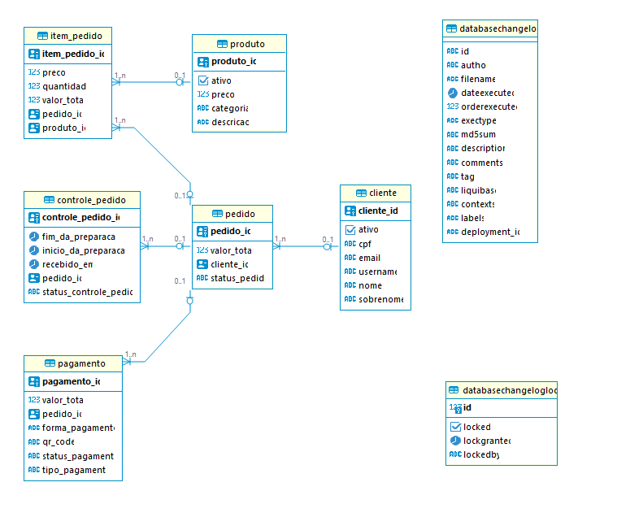

# Is My Burguer

Projeto para aplicação de conhecimentos da Fase 3 da Pós-Graduação em SOFTWARE ARCHITECTURE da FIAP

# Modelo Entidade Relacionamento

### Tabela Pedido

É a tabela principal do sistema. A partir dela saem todos os outros relacionamentos e é o principal controle que o sistema precisa fazer segundo a solicitação do cliente.
Ela controla o status do pedido na fila, guarda a identificação do **Cliente** vinculado e serve de ligação entre as outras tabelas.
Nela também está o valor total do pedido, que é gravado em banco para evitar ir em outras tabelas ou buscar essa informação favorecendo a performance.
Sabe-se que isso fere a terceira forma normal na modelagem de dados porém a experiência prévia em sistemas de ERP me mostrou que por vezes essa é a melhor forma de trabalhar com os dados.

### Tabela Item Pedido

É a tabela que guarda as informações do itens solicitados pelo cliente, guardando o preço, a quantidade, a identificação do produto pedido e o valor total.
Nela também está o valor total do item do pedido, que é gravado em banco para evitar ir em outras tabelas ou buscar essa informação favorecendo a performance.
Sabe-se que isso fere a terceira forma normal na modelagem de dados porém a experiência prévia em sistemas de ERP me mostrou que por vezes essa é a melhor forma de trabalhar com os dados.

### Tabela Cliente

Foi a mais modificada da Fase 2 para a Fase 3 pois ela armazena todos os dados referentes ao cliente além do seu login no sistema de autenticação. 
Todas as informações nela serão réplicas das informações guardadas no AWS Cognito, sendo ele (Cognito), a fonte principal das informações do Cliente logado.

### Tabela Produto

É a tabela de controle de preços e de ofertas do cardápio. Nela são armazenadas as informações dos Lanches, Sobremesas e Bebidas do cardápido e é mapeada como chave estrangeira na tabela **Item Pedido** para definição do item escolhido pelo cliente. Permite exclusão lógica por meio da coluna **ativo**.

### Tabela Controle Pedido

É a tabela de utilizada para exibição dos pedidos em fila e também para guardar o histórico de atendimento da lanchonete. Pode ser utilizada para extração de relatórios e verificação da produtividade e velocidade das entregas no estabelecimento. Tem vínculo com o **Pedido** e também serve para controlar o status da fila da lanchonete.

### Pagamento

Essa tabela garante que os pedidos foram pagos antes de serem enviados para a fila, evitando assim fraudes ou retirada de pedidos não pagos e também fornece uma estrutura para levantamento do faturamento da loja, já que um pedido pode não ser concluído. Tem vínculo com o **Pedido** e armazendo também a forma de pagamento que foi utilizada, favorecendo o desenvolvimento de campanhas de promoção e desconto ao fornecer a informação de qual meio de pagamento mais utilizado no estabelecimento.

# Por que Postgres?

O PostgreSQL pode lidar eficientemente com as demandas de uma aplicação monolítica, processando grandes volumes de dados de forma confiável.

Quando se trata de escalabilidade, embora o PostgreSQL não tenha as mesmas capacidades de escalabilidade horizontal imediatamente disponíveis como alguns sistemas NoSQL, como o MongoDB ou Cassandra, ele ainda oferece opções de escalabilidade vertical e horizontal através de técnicas como replicação, particionamento de tabelas e uso eficiente de índices.

Em uma aplicação monolítica, a integração com outras partes do sistema é essencial. Nesse quesito os bancos relacionais tem uma vantagem extra por terem como requisito principal garantir a integridade entre os relacionamentos.

# Terraform 

<!-- BEGIN_TF_DOCS -->
## Requirements

| Name | Version |
|------|---------|
|  [terraform](#requirement\_terraform) | >= 1.0 |
|  [aws](#requirement\_aws) | >= 5.33 |

## Providers

| Name | Version |
|------|---------|
|  [aws](#provider\_aws) | 5.39.0 |

## Modules

| Name | Source | Version |
|------|--------|---------|
|  [vpc](#module\_vpc) | terraform-aws-modules/vpc/aws | n/a |

## Resources

| Name | Type |
|------|------|
| [aws_db_instance.is-my-burguer](https://registry.terraform.io/providers/hashicorp/aws/latest/docs/resources/db_instance) | resource |
| [aws_security_group.postgres](https://registry.terraform.io/providers/hashicorp/aws/latest/docs/resources/security_group) | resource |

## Inputs

| Name | Description | Type | Default | Required |
|------|-------------|------|---------|:--------:|
|  [TF\_VAR\_POSTGRES\_PASSWORD](#input\_TF\_VAR\_POSTGRES\_PASSWORD) | The master password for the database. | `string` | n/a | yes |
|  [TF\_VAR\_POSTGRES\_USER](#input\_TF\_VAR\_POSTGRES\_USER) | The master username for the database. | `string` | n/a | yes |

## Outputs

| Name | Description |
|------|-------------|
|  [database\_endpoint](#output\_database\_endpoint) | The endpoint for the RDS cluster |
|  [database\_endpoint\_host](#output\_database\_endpoint\_host) | The address for the RDS cluster |
|  [database\_endpoint\_port](#output\_database\_endpoint\_port) | The port for the RDS cluster |
|  [database\_instance](#output\_database\_instance) | The name for the RDS cluster |
<!-- END_TF_DOCS -->
